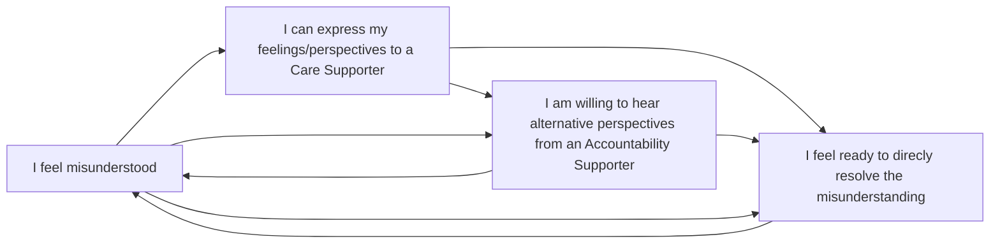

[**Conduct Supporter roles**](../../agreements/supporter_agreement) are intended to help us distribute the labour of supporting each other to act in alignment with our [Conduct Agreement](../../agreements/conduct_agreement). 

The following guidelines outline our in-progress collection of tips & tools for learning when to ask for care and accountability support, and what to offer when we're asked for each of these specific forms of conduct support.

## When and How to Request Support?
Practising asking for support in low-consequence contexts, can help prepare us for when we need to support each other navigate high-consequence forms of conflict.

Examples of some of the low-consequence contexts we can practice seeking support include: when we experience feelings about how others are participating in the collective; when we learn that the way we're participating in crews is impacts others in ways we did not intend; and when we have a minor disagreement we're unable to resolve directly with another participant.  

#### Identifying when to talk who, about what 
While both types of support will be relevant for most situations, recognising which form of support is most useful when is part of what we're practising. 

* Care support offers a [holding space](https://psychhub.com/resources/articles/holding-space) to practice expressing our feelings and reflecting on our experiences  without exposing ourselves to either judgement or rescue.

* Accountability support offers a gentle challenge to practice reflecting on alternative perspectives and holding *ourselves* accountable for how our actions impact others (without policing each others' behaviour). See this video on [What is Accountability?](https://www.youtube.com/watch?v=QZuJ55iGI14)

Cultivating an [empowerment triangle, rather than a drama triangle](https://beckett-mcinroy.com/articles/resolving-conflict/) the goal is to support each other to directly navigate generative conflict. The following diagram offers an example of the varied and iterative pathways we might seek out each of our Supporters for one instance of feeling misunderstood: 

#### Ask for support:
Once you know who you want to talk to about what:
- Contact whoever is in the relevant Supporter role(s) in relation to you  
- Offer a brief overview of the scope of your request and check if they are willing and able to offer support. 
- Once the support request has been articulated and consented to, agree on the format of communication and any [structured-discussion tools](https://hackmd.io/@IntentionalRelationships/metacommunication).
- At an agreed time/place, take a moment to [HALT+](https://www.multiamory.com/podcast/218-ive-halted-now-what) and check that everyone has capacity to give the conversation the appropriate level of attention. If anyone does not have capacity, set another time to reconvene.

## When & How to Offer Support
Your core role as a Conduct Supporter is to respond to requests for specific forms of support within the scope of our shared conduct expectations within the Brassica Collective.

### Tips & Tools for Offering Care Support

**Holding space for participants to express their feelings and perspectives without judging or rescuing.** 
* Create a container where you can be present and actively listen to someone express the feelings associated with a situation offering *tenderness, attentiveness, regard, and consideration* 
* The goal is to create space for people to feel whatever it is they are feeling; not to help people feel "better" or solve their concerns.
* Focus on allowing whatever the feeling are to be expressed; avoid asking "why", expressing any opinions, alternative perspectives, or advice
* Practice using a [*peer listening*](https://loomio.shedberries.app/d/4ZQ5Jg3p/facilitation-notes-from-interval-16-workshop-on-basic-peer-support-skills) container

**Responding to requests for care following situations in which participants felt misunderstood and/or contributed to others feeling misunderstood; participated in or witnessed a conflict; and/or contributed to or experienced harm.** 
* Supporting a participant to articulate and share their perspective of behaviours within the collective they experience as contributing to misunderstandings, conflict, or harmful situations.  
* Focus on encouraging expressions of perspective, ask clarification questions with *curiosity*
* Encourage different ways of *sharing* their [partial perspectives](https://hackmd.io/@Teq/perspective-sharing-examples)

**Supporting a participant to *initiate* the appropriate ‘Response Guidelines’ from our Conduct Agreement**
- When someone identifies actions by someone within the collective as at odds with shared expectations or values, remind them reach out to their Accountability Supporter for additional forms of conduct support to seek additional perspectives  

### Tips & Tools for offering Accountability Supporter

**Supporting people to consider alternative perspectives**
* Offer alternative [partial perspectives](https://hackmd.io/@Teq/perspective-sharing-examples) on [what else might be true](http://www.deanspade.net/wp-content/uploads/2025/07/Dean-Spade-EP04-What-Else-Is-True-worksheet.pdf) with regards to the situation when listening to an interpretation of a situation (avoid forming judgements or offering advise). 
* Use the [ladder of inference framework](https://untools.co/ladder-of-inference/) to support them to consider the role of assumptions, observations, conclusions, and actions in their interpretations .  

**Initiating 'courageous conversations' that support people to engage with multiple perspectives on how their actions in the collective may have contributed to a particular situation of misunderstanding, conflict, or harm.** 

* Offer examples of when/how actions aren’t aligning with our collectively agreed expectations.  
* Provide a practice-partner to role-play different ways of interacting
  
**Signs that someone may be ready to hold themselves accountable for the consequences of their actions include:**
- Recognising and sitting with uncomfortable feelings;
- Identifying when/how actions aligned with values (or not)
- Acknowledging when and how the relevant actions impacted others
- Engaging constructively with requests for behavioural changes
- Willing to commit to specific changes in behaviours and/or expectations moving forward.

> *“People can support you to be accountable, but no one but you can do the hard work of taking accountability for yourself. Don’t wait until someone else has to bring up your behavior.” [(Mia Mingus)](https://leavingevidence.wordpress.com/2019/12/18/how-to-give-a-good-apology-part-1-the-four-parts-of-accountability/)*

**Tips for supporting people who want to hold themselves accountable for the ways their actions were felt by themselves or others to have contributed to misunderstandings, conflict, and/or harmful situations** 
- Support engagement in the relevant processes outlined in our other agreements    
- Reminding participants to reach out to their Care Supporter for additional forms of conduct support.
- Offer resources, such as:
    - [How to give a good apology](https://leavingevidence.wordpress.com/2019/12/18/how-to-give-a-good-apology-part-1-the-four-parts-of-accountability/)*   

**Tips for supporting a participant to *engage with a Conduct Agreement response* after learning that they have acted in ways that feel to another participant as at odds with the shared expectations outlined in our Conduct Agreement.**

## Further Resources 

> "... I finally, finally, take a deep breath and ask for the care I need most from my friends, and am able to do this because of the collective work done to make accepting that care safe and possible." [Leah Lakshmi Piepzna-Samarasinha](https://amplifybookstore.com/products/the-future-is-disabled-by-leah-lakshmi-piepzna-samarasinha?variant=47864940691735) 

The following resources focus on approaches to conflict that seek to transform oppressive dynamics, our relationships to each other, and our communities at large. 

- A Commons Library resource roundup on navigating [inevitable conflicts](https://commonslibrary.org/conflict-is-inevitable-knowledge-roundup/),
- An introduction to [transformative approaches to navigating conflict](https://commonslibrary.org/transformative-approaches-to-conflict-resolution/)
- [Progressive Therapeutic Collective Radical Repair Toolkit](https://drive.google.com/file/d/13FYQP20FZHr7FSokCQYzRdelmn0eb2A1/view?usp=drive_link) Sarah Newbold© 2025 Underground Radical, Naarm offers a bold approach to relationship repair that challenges power, prioritises equity, and fosters connection in every relationship.
- [From conflict to co-operation - a Primer](https://peoplesupport.coop/from-conflict-to-cooperation/) - Written by Kate Whittle, Cooperantics, and illustrated by Angela Martin. This From Conflict to Co-operation series aims to help co-operatives not only to deal with conflict when it arises but also to avoid unnecessary conflict.
- [Conflict Resolution Trainers Manual](https://www.crnhq.org/cr-trainer-manual/) This manual is a comprehensive guide running for highly successful Conflict Resolution sessions. It offers teaching material, group and individual exercises and handouts for over 50 hours of instruction on the 12 skills of Conflict Resolution. Each chapter starts with clear guidelines for constructing training sessions of different lengths. It is invaluable for a new trainer and will refresh and inspire even the most experienced trainer’s material. 
- [Community Accountability process](https://callingupjustice.com/fumbling-towards-repair/)
- [Upstream podcast episode Nov 7 2024 "Prefigurative Politics and Workplace Democracy w/Saio Gradin and Nicole Wires"](https://www.upstreampodcast.org/conversations) 

