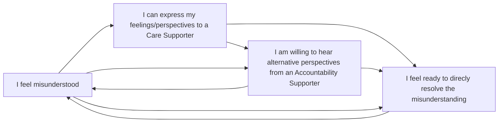

[**Conduct Supporter roles**](../../agreements/supporter_agreement) are intended to help us distribute the labour of supporting each other to act in alignment with our [Conduct Agreement](../../agreements/conduct_agreement). 

The following guidelines outline our in-progress collection of tips & tools for learning when to ask for care and accountability support, and what to do when we're asked for each of these specific forms of support. 

## When to Ask & Offer Support?
Ask for support early and often, and respond to support requests generously. 

By practising on small forms of support within the scope of our shared conduct expectations, we hope to build our collective capacity for supporting each to other navigate higher consequence forms of conflict. 

Examples of low-consequence contexts we can practice seeking support include: 
- When we experience feelings about how others are participating in the collective 
- When we learn our ways of communicating impact others in ways we did not intend 
- When we have a minor disagreement we're unable to resolve directly with another participant 

We'll explore more options as we all begin to learn how to respond to specific support requests. For now, we encourage participants to reach out to each of our Supporters at least once an interval. To enable this, Conduct Supporters are expected to be available for up to 1hr of support for each supported participant per interval.

## Identifying who to talk to about what
Who our Supporters are, and who we are supporting, will be visible on our RADicalise Participation Dashboard.

While both types of support will be relevant for most situations, recognising which form of support is most useful when is part of what we're practising. 

* Care support offers a [holding space](https://psychhub.com/resources/articles/holding-space) to practice expressing our feelings and reflecting on our experiences  without exposing ourselves to either judgement or rescue.

* Accountability support offers a gentle challenge to practice reflecting on alternative perspectives and holding *ourselves* accountable for how our actions impact others (without policing each others' behaviour). See this video on [What is Accountability?](https://www.youtube.com/watch?v=QZuJ55iGI14)

The goal is to support each other to directly navigate generative conflict. The following diagram offers one example of the varied and iterative pathways we might seek out each of our Supporters: 

## Tips and Tools for Asking for Support

Once you know which Supporter you want to talk to about what, contact whoever is in the relevant Supporter role in relation to you. Try to practice the following steps:
1.  Make a direct request. Briefly outlining the scope of the request can help Supporters make informed decision about providing the requested support (see Example Requests below). 

2. Take a moment to [HALT+](https://www.multiamory.com/podcast/218-ive-halted-now-what) to check that everyone has capacity to give the conversation the appropriate level of attention prior to starting the discussion. If anyone does not have capacity, set another time to reconvene.

3. Confirm the time-container (e.g., 20 mins) and choose an appropriate form of [structured-discussion](https://hackmd.io/@IntentionalRelationships/metacommunication) together (see Tips & Tools below).

## Tips & Tools for Responding to Care Support Requests

**Holding space for participants to express their feelings and perspectives without judgement or advice.** 
* Create a container where you can be present and actively listen to someone express the feelings associated with a situation offering *tenderness, attentiveness, regard, and consideration* 
* The goal is to create space for people to feel whatever it is they are feeling; not to help people feel "better" , solve their concerns, or otherwise rescue them.
* Focus on allowing whatever the feeling are to be expressed; avoid asking "why", expressing any opinions, alternative perspectives, or advice
* We are practising structuring these discussion using [peer listening containers](https://loomio.shedberries.app/d/4ZQ5Jg3p/facilitation-notes-from-interval-16-workshop-on-basic-peer-support-skills) 

**Responding to requests for care following situations in which participants felt misunderstood and/or contributed to others feeling misunderstood; participated in or witnessed a conflict; and/or contributed to or experienced harm.** 
* Listen to their perspective of others' behaviours within the collective, holding space for their interpretations and feelings, and asking any clarification questions with *curiosity* 
* One way to structure this form of support is to focus on encouraging participants to [share their interpretations of a situation, within the context of the participant's partial perspectives](https://hackmd.io/@Teq/perspective-sharing-examples)

**Supporting a participant to initiate the appropriate Response Guidelines from our Conduct Agreement**
- When someone identifies actions by someone within the collective as at odds with shared expectations or values, remind them to reach out to their Accountability Supporter to to seek additional perspectives and additional forms of conduct support.

## Tips & Tools for offering Accountability Supporter Requests

> *“People can support you to be accountable, but no one but you can do the hard work of taking accountability for yourself. Don’t wait until someone else has to bring up your behavior.” - [(Mia Mingus)](https://leavingevidence.wordpress.com/2019/12/18/how-to-give-a-good-apology-part-1-the-four-parts-of-accountability/)*

**Practise courageous conversations**
* Listen to their interpretation of a situation (avoid forming judgements or offering advise), then use the [ladder of inference framework](https://untools.co/ladder-of-inference/) to support consideration of the role of assumptions, observations, conclusions, and actions in their interpretations .
* Support people to engage with multiple perspectives on how their actions in the collective may have contributed to a particular situation of misunderstanding, conflict, or harm. For example, consider asking [what else might be true](http://www.deanspade.net/wp-content/uploads/2025/07/Dean-Spade-EP04-What-Else-Is-True-worksheet.pdf) and offering [alternative partial perspectives](https://hackmd.io/@Teq/perspective-sharing-examples). 

**Supporting people who want to hold themselves accountable for the ways their actions were felt by themselves or others to have contributed to misunderstandings, conflict, and/or harmful situations** 
* Initiate courageous conversations (see above) and remind participants to reach out to their Care Supporter as well.
* Provide a [sounding-board](https://grammarist.com/idiom/sounding-board/) for them to explore when/how their actions align with our collectively agreed expectations.  
* Acknowledge signs of readiness to hold themselves accountable for the consequences of their actions. Examples include:
    - Recognising and sitting with uncomfortable feelings;
    - Identifying when/how actions aligned with values (or not)
    - Acknowledging when and how the relevant actions impacted others
    - Engaging constructively with requests for behavioural changes
    - Willing to commit to specific changes in behaviours and/or expectations moving forward.
* Provide a practice-partner to role-play talking directly with others involved in the situation.
* Support engagement in the relevant processes outlined in our other agreements 

**Supporting a participant to *engage with a Conduct Agreement response* after learning that they have acted in ways that feel to another participant as at odds with the shared expectations outlined in our Conduct Agreement.**
- Offering reminders to reach out to their Care Supporter for a container to express their feelings and additional forms of conduct support and then return for more Accountability support.
- Offer containers for courageous conversations (see above)
- Offer resources, such as [How to give a good apology](https://leavingevidence.wordpress.com/2019/12/18/how-to-give-a-good-apology-part-1-the-four-parts-of-accountability/)*   

## A Reminder to Cultivate Additional Support Networks

By practising with this structured support system we’re pushing back on defaults. This is difficult, and takes time. In the meantime, our efforts will not always go well. In these cases, please ask for support from whomever you would have gone to if we didn’t have assigned support people. 

When you feel you can, please reach out to your assigned support person again to talk about the experience (how it went, how it could have gone differently). 

## Example Support Requests

Including a clear scope for your request can help Supporters make informed decision about providing the requested support. The examples below include formats that outline a brief overview of the context and request a specific format and timeline for support.

Also see the [examples shared in Loomio](https://loomio.shedberries.app/d/ow365eOI/examples-of-conduct-support-requests)

Example 1 - Care Support Only 
> "Hi, thanks for being my care supporter - I'm feeling really sad so few folk attended the workshop I facilitated; do you have 10 min for a call to hold a container and listen to me vent my feelings about that within the next day or so?"

Example 2: - Accountability Support Only
> "Hey thanks for being my accountability supporter. I've learned that others felt like I spoke over people a lot in the last Assembly. I'd like to learn how to listen more in meetings - do you have time this interval to meet up with me and help me practice active listening?

Example 3 - Care --> Accountability --> Care 
> "Hi, thanks for being my care supporter. Can we arrange a 15 min call in the next few days? I'd like to talk through my experience of how a recent Crew meeting was facilitated.

>  “Hi, are you available for a 30 min calls this week as my Brassica accountability supporter? I had a tense verbal exchange at a recent Crew meeting. I have talked to my care supporter already and would now like help to think about what I could have done differently in that situation.” 

> "Hey, thanks for the care support earlier. I've talked to my accountability supporter and heard about how my actions may have contributed to the situation I expressed frustration about last we talked. I want to resolve the tensions my actions have contributed to but have lingering feelings of defensiveness. Can we arrange another 10 min call this week for me to express those feelings before I talk to others on the crew?"

## Further Resources 

> "... I finally, finally, take a deep breath and ask for the care I need most from my friends, and am able to do this because of the collective work done to make accepting that care safe and possible." [Leah Lakshmi Piepzna-Samarasinha](https://amplifybookstore.com/products/the-future-is-disabled-by-leah-lakshmi-piepzna-samarasinha?variant=47864940691735) 

The following resources focus on approaches to conflict that seek to transform oppressive dynamics, our relationships to each other, and our communities at large. 

- A Commons Library resource roundup on navigating [inevitable conflicts](https://commonslibrary.org/conflict-is-inevitable-knowledge-roundup/),
- An introduction to [transformative approaches to navigating conflict](https://commonslibrary.org/transformative-approaches-to-conflict-resolution/)
- [Progressive Therapeutic Collective Radical Repair Toolkit](https://drive.google.com/file/d/13FYQP20FZHr7FSokCQYzRdelmn0eb2A1/view?usp=drive_link) Sarah Newbold© 2025 Underground Radical, Naarm offers a bold approach to relationship repair that challenges power, prioritises equity, and fosters connection in every relationship.
- [From conflict to co-operation - a Primer](https://peoplesupport.coop/from-conflict-to-cooperation/) - Written by Kate Whittle, Cooperantics, and illustrated by Angela Martin. This From Conflict to Co-operation series aims to help co-operatives not only to deal with conflict when it arises but also to avoid unnecessary conflict.
- [Conflict Resolution Trainers Manual](https://www.crnhq.org/cr-trainer-manual/) This manual is a comprehensive guide running for highly successful Conflict Resolution sessions. It offers teaching material, group and individual exercises and handouts for over 50 hours of instruction on the 12 skills of Conflict Resolution. Each chapter starts with clear guidelines for constructing training sessions of different lengths. It is invaluable for a new trainer and will refresh and inspire even the most experienced trainer’s material. 
- [Community Accountability process](https://callingupjustice.com/fumbling-towards-repair/)
- [Upstream podcast episode Nov 7 2024 "Prefigurative Politics and Workplace Democracy w/Saio Gradin and Nicole Wires"](https://www.upstreampodcast.org/conversations) 
- A guide to cultivating [empowerment triangles, rather than drama triangles](https://beckett-mcinroy.com/articles/resolving-conflict/). 

